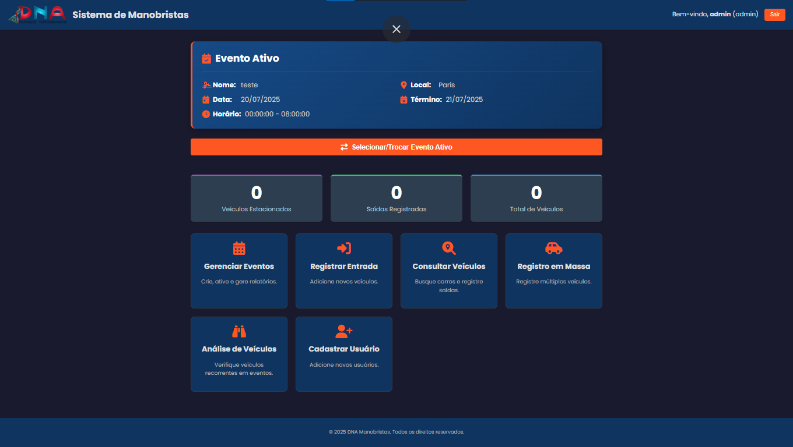
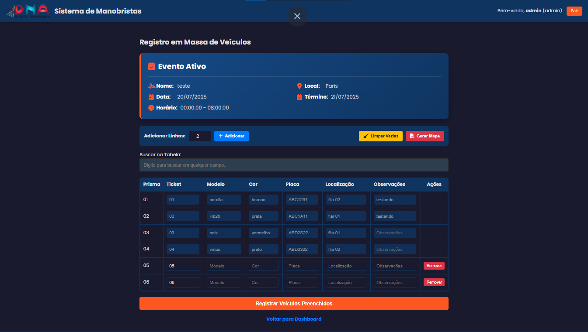
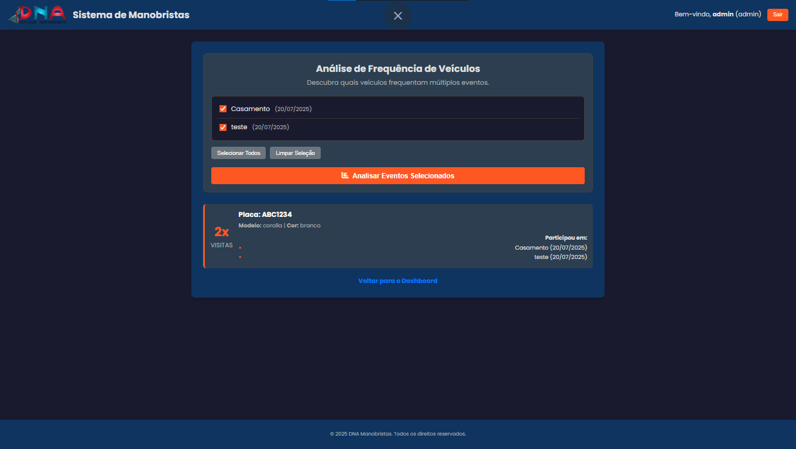
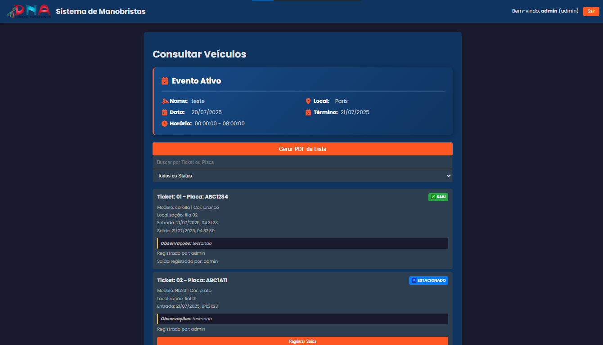

# Sistema de Gestão de Manobristas - DNA

Bem-vindo ao repositório do Sistema de Gestão de Manobristas DNA! Este projeto é uma aplicação web completa, projetada para otimizar e profissionalizar a operação de serviços de manobrista em eventos, com ferramentas robustas para a equipe de gestão, orientadores e manobristas.

---

## 📸 Demonstração Visual

**Dashboard Principal (Visão do Administrador)**
_Acesso rápido a todas as funcionalidades do sistema, com navegação clara e intuitiva._


**Registro em Massa de Veículos**
_Interface otimizada para agilidade, permitindo o registro rápido de múltiplos veículos com edição em linha._


**Análise de Frequência de Veículos**
_Ferramenta de BI para identificar veículos recorrentes em múltiplos eventos, ajudando a reconhecer clientes fiéis._


**Consulta de Veículos**
_Busca e filtragem de veículos por status (estacionado/saiu) e geração de relatórios em PDF da lista atual._


---

## 🛠️ Tecnologias e Infraestrutura

O projeto foi construído com uma stack moderna e robusta, garantindo performance e escalabilidade.

**Frontend:**

<div>
  
  
  
</div>

**Backend:**

<div>
  
  
</div>

**Banco de Dados e Autenticação:**

<div>
  
  
  
</div>

**Infraestrutura de Produção:**

<div>
  
  
</div>

---

## ✨ Funcionalidades Principais

- **Autenticação e Autorização:** Sistema de login seguro com diferentes níveis de acesso baseados em cargo (Admin, Orientador, Manobrista).
- **Dashboard Interativo:** Visão geral com estatísticas em tempo real do evento ativo e acesso rápido às funcionalidades permitidas.
- **Gestão Completa de Eventos:** Criação, ativação, desativação, exclusão segura e geração de relatórios PDF completos por evento.
- **Operação de Veículos:** Registro individual e em massa, consulta com filtros avançados e registro de saída.
- **Análise de Frequência de Veículos:** Ferramenta de BI para identificar veículos recorrentes em múltiplos eventos.

---

## 🚀 Como Rodar o Projeto Localmente

### Pré-requisitos

- Node.js (versão LTS recomendada)
- Um cliente MySQL (como MySQL Workbench ou DBeaver)
- Git

### 1. Configuração do Backend

1.  **Clone o repositório:**

    ```bash
    git clone https://github.com/Alexandre-dev01/Sistema-gestao-manobrista.git
    cd Sistema-gestao-manobrista
    ```

2.  **Navegue até a pasta do backend:**

    ```bash
    cd backend
    ```

3.  **Instale as dependências:**

    ```bash
    npm install
    ```

4.  **Configure o Banco de Dados:**

    - No seu cliente MySQL, crie um novo banco de dados (ex: `manobrista_db` ).
    - Execute os scripts `CREATE TABLE` para `usuarios`, `eventos` e `veiculos` (disponíveis na seção "Estrutura do Banco de Dados" abaixo).

5.  **Crie o arquivo de ambiente:**

    - Na pasta `backend`, crie um arquivo chamado `.env`.
    - Preencha-o com suas credenciais do banco de dados local:

    ```env
    DB_HOST=localhost
    DB_USER=seu_usuario_mysql
    DB_PASSWORD=sua_senha_mysql
    DB_NAME=manobrista_db
    DB_PORT=3306
    JWT_SECRET=crie_uma_chave_secreta_aqui_para_jwt
    ```

6.  **Inicie o servidor backend:**
    ```bash
    npm start
    ```
    O servidor estará rodando em `http://localhost:3000`.

### 2. Configuração do Frontend

1.  **Abra o arquivo `frontend/config.js`**.
2.  **Aponte para o seu backend local:** Certifique-se de que a variável `API_BASE_URL` esteja configurada para o seu servidor local:
    ```javascript
    const API_BASE_URL = "http://localhost:3000";
    ```
3.  **Abra um arquivo `.html`:** Use uma extensão como o **Live Server** do VS Code para abrir o `frontend/index.html` no seu navegador.

### 3. Criando o Usuário Admin

Para usar o sistema, você precisa de um usuário `admin`. Como o cadastro é restrito, o primeiro usuário deve ser inserido manualmente.

1.  **Gere uma senha criptografada (hash):** Use uma ferramenta online para gerar um hash bcrypt da sua senha desejada.
2.  **Execute o comando SQL** no seu banco de dados local, substituindo pelo hash gerado:
    ```sql
    INSERT INTO usuarios (nome_usuario, senha, cargo) VALUES ('admin', 'SEU_HASH_GERADO_AQUI', 'admin');
    ```

---

## 🗄️ Estrutura do Banco de Dados

```sql
-- Tabela de Usuários
CREATE TABLE usuarios (
    id INT AUTO_INCREMENT PRIMARY KEY,
    nome_usuario VARCHAR(50) NOT NULL UNIQUE,
    senha VARCHAR(255) NOT NULL,
    cargo ENUM('admin', 'orientador', 'manobrista') NOT NULL
);

-- Tabela de Eventos
CREATE TABLE eventos (
    id INT AUTO_INCREMENT PRIMARY KEY,
    nome_evento VARCHAR(100) NOT NULL,
    data_evento DATE NOT NULL,
    data_fim DATE NOT NULL,
    hora_inicio TIME NOT NULL,
    hora_fim TIME NOT NULL,
    local_evento VARCHAR(100) NOT NULL,
    descricao VARCHAR(255),
    is_active BOOLEAN DEFAULT FALSE
);

-- Tabela de Veículos
CREATE TABLE veiculos (
    id INT AUTO_INCREMENT PRIMARY KEY,
    evento_id INT NOT NULL,
    numero_ticket VARCHAR(20) NOT NULL,
    modelo VARCHAR(100) NOT NULL,
    cor VARCHAR(50) NOT NULL,
    placa VARCHAR(10) NOT NULL,
    localizacao VARCHAR(100) NOT NULL,
    observacoes VARCHAR(255),
    hora_entrada DATETIME NOT NULL,
    hora_saida DATETIME,
    status ENUM('estacionado', 'saiu') DEFAULT 'estacionado',
    usuario_entrada_id INT NOT NULL,
    usuario_saida_id INT,
    FOREIGN KEY (evento_id) REFERENCES eventos(id) ON DELETE CASCADE,
    FOREIGN KEY (usuario_entrada_id) REFERENCES usuarios(id),
    FOREIGN KEY (usuario_saida_id) REFERENCES usuarios(id)
);
```

---

## 🗺️ Roadmap Futuro (Módulo Cliente)

Para expandir o valor comercial do sistema, planejamos implementar um módulo de interação direta com o cliente. As funcionalidades planejadas são:

| Funcionalidade                   | Descrição                                                                                              | Status    |
| -------------------------------- | ------------------------------------------------------------------------------------------------------ | --------- |
| 🎟️ **Tickets Digitais**          | Geração de QR Codes e códigos alfanuméricos para cada veículo registrado.                              | Planejado |
| 📱 **Web App do Cliente**        | Uma interface simples para o cliente solicitar seu veículo digitando o ticket ou escaneando o QR Code. | Planejado |
| 📊 **Dashboard de Solicitações** | Uma nova tela para a equipe visualizar e gerenciar as solicitações de veículos em tempo real.          | Planejado |
| 🔔 **Notificações (Fase 2)**     | Envio de SMS/WhatsApp para o cliente informando o status da entrega do seu veículo.                    | A Definir |

---

## 🤝 Contribuição

Contribuições são muito bem-vindas! Se você tiver sugestões, melhorias ou encontrar bugs, sinta-se à vontade para abrir uma **Issue** ou enviar um **Pull Request**.

---

## 📝 Licença

Este projeto está licenciado sob a [MIT License](LICENSE).
